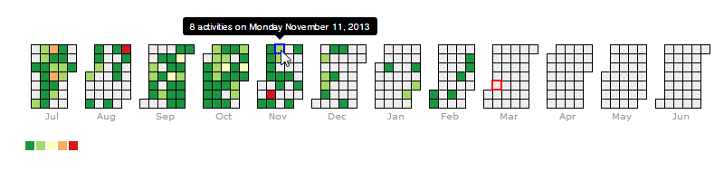
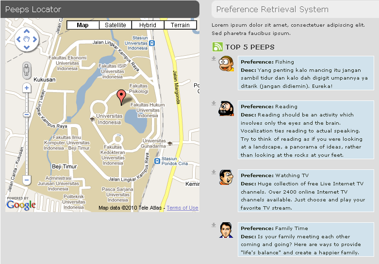

# dwiyatcita-adolescence-portfolio

(partially) Curated projects during my university years.

## Webav (Workspace Events Banner Visualization)

##### 2014

###### Computer-Supported Cooperative Work · Lead Developer

Experimental workspace events banner visualization for BSCW collaborative
workspace. Webav was aimed to provide better asynchronous workspace
awareness support within a BSCW system. This research project was part of my
Master's thesis at Fraunhofer-FIT department in Sankt Augustin, Germany.

**Screenshots**:

---

---

---

---

---

## PeeroraBox (called off)

##### 2014

###### Dropbox Addons · Inventor

Projected to be a server-based app which allows Dropbox user to easily search
for publicly shared files from other Dropbox users, and quickly exchange them:
D2D (Dropbox-to-Dropbox file exchanging system), as opposed to P2P.

**Screenshots**:

---

---

---

---

---

---

---

---

---

---

---

---

---

---

---

---

---

## Memetrekker - Facebook Application (prototype)

##### 2013

###### Computer-Supported Cooperative Work · Lead Developer

A Facebook web application which tracks when and where information has
been accessed, forwarded and to whom. This application was developed during
CSCW Experience Lab at Fraunhofer-FIT department in Sankt Augustin,
Germany.

**Screenshots**:

---

---

---

---

---

## MC-2 - Wired Sensor Network Visualization Application

##### 2012

###### Communication and Distributed Systems · Lead Developer

A multi-platform (Java) desktop application which is able to effectively
visualize the network, node, and environment history of Crossbow’s TelosB
motes. This application was developed during Sensor Networks Lab at
COMSYS department in Aachen, Germany.

**Screenshots**:

---

---

---

---

---

---

---

---

---

---

## Ludovico - P2P File Sharing Application

##### 2012

###### Data Communication and Internet Technology · Inventor, Lead developer

A Windows-platform desktop application which enables students to share files
within Studentenwerk dormitories in Bonn, Germany. This application was
built in a decentralized Peer-to-Peer fashion, on the top of PNRP protocol by
Microsoft.

**Screenshots**:

---

## Demeter - Wireless Sensor Network Monitoring and Visualization Software

##### 2011

###### Embedded System, Wireless Sensor Network · Co-Inventor, Developer

A Windows-platform desktop application which is used by a proprietary
ZigBee-based Wireless Sensor Network (WSN) system for monitoring sensor,
controlling actuators, and visualizing data from each of its wireless node in the
network. The system was used by some researchers in agricultural area and was
part of my Bachelor's thesis.

**Screenshots**:

---

---

---

---

## PeePL - Information Retrieval System (Prototype)

##### 2010

###### Information Retrieval · Inventor, Lead developer

A web-based application which enables its user to retrieve information about
other users based on the similarity of their preferences (hobbies, interests,
activities), and locates some nearest users in a map. This application was built
using vector space IR model and was powered by Google Maps®.

**Screenshots**:

---

---

## Modora - Basic Local Alignment Search Tool

##### 2010

###### Bioinformatics · Inventor, Lead developer

A Windows-platform desktop application which enables Indonesian biologists
to interactively measure the similarity value between the unknown amino acid
sequences and the ones which their functions and gene specifications have been
known.

**Screenshots**:

---

---

---

---

---

---

## MinUI™ Compiler

##### 2010

###### Compiler · Developer

A programming language processor model with Java-based tools.

## AESGGTM - Text Encryption Tool

##### 2010

###### Cryptography and Information Security · Developer

A Java command-line application for en/decrypting text by using AES-128 with
16-byte-block Counter Mode (CTR) as its mode of operation.

## Pandora - Image Classifier

##### 2009

###### Digital Image Processing · Lead developer

A multi-platform (Java) desktop application which can be used to do a
supervised classification on an image. The implementation was based on the
Minimum Euclidian Distance (MED) and Gaussian Maximum Likelihood
Based (GMLB) algorithm.

**Screenshots**:

---

---

